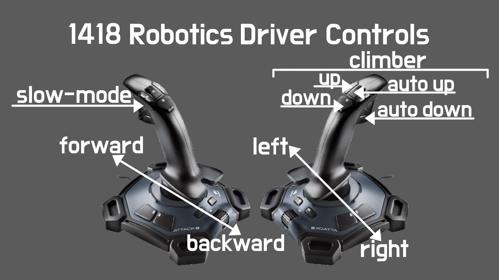
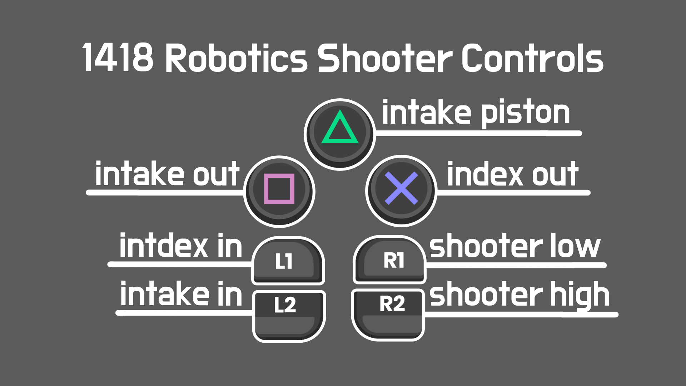

# 2022-robot
Code for our 2022 competition robot 🤖.

## Controls
We use two joysticks and one ps3 controller to control the robot:

* 2 x **Logitech Attack 3** (`leftJoystick` and `rightJoystick`)
* 1 x **ZD-V+ Gaming Controller** (`altJoystick`)

["PS4 Buttons"](https://arks.itch.io/ps4-buttons) by [Arks💢](https://itch.io/profile/arks) is licensed under [CC BY 4.0](https://creativecommons.org/licenses/by/4.0/)

## Run Code With Gradle
Gradle allows us to build and deploy our Java code to the robot
1. Right-click on the `build.gradle` file in Visual Studio Code and press `Build Robot Code` to build the code
1. Fix any problems that come up and repeat steps 1 and 2 until the terminal says **BUILD SUCCESSFUL**
    1. A common problem that may come up has to do with formatting, which is shown by the error `Execution failed for task ':spotlessJavaCheck'`. You can fix this problem by running `./gradlew :spotlessApply` in a terminal window
1. Connect to the robot’s wifi
1. Right-click on the `build.gradle` file in Visual Studio Code and press `Deploy Robot Code` to deploy the code